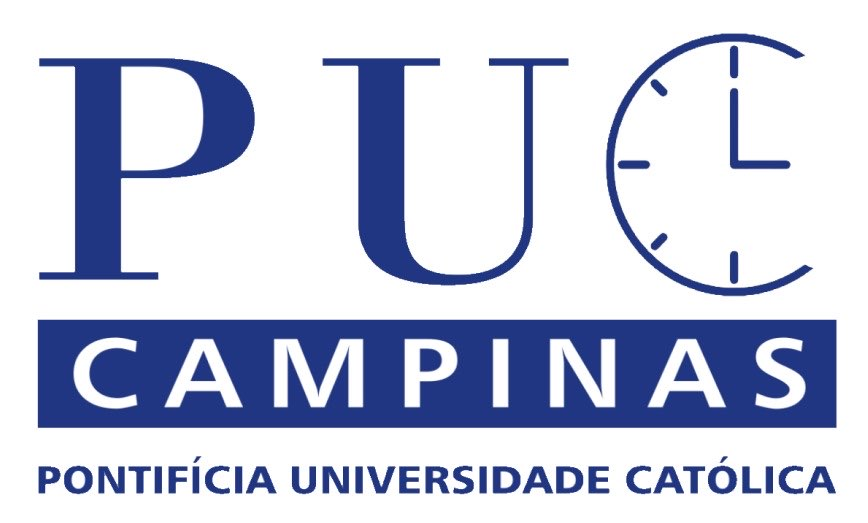

# PUC TIME - PROJETO INTEGRADOR III

### O projeto tem como objetivo principal facilitar o registro da entrada e saída dos colaboradores da PUC Campinas. Por meio de um aplicativo desenvolvido em Kotlin, os usuários poderão registrar seu ponto de forma simples e rápida, utilizando seus dispositivos móveis.

> Status do projeto: Em desenvolvimento! 

### Participantes: 
|Nome|R.A.
| -------- | -------- |
|Felipe Viotto Buzziol|23000490|
|Gustavo Miranda dos Santos|23002793|
|Matheus Mendes Machado|23001767|
|Victor Hugo Marino Caproni|23010759|